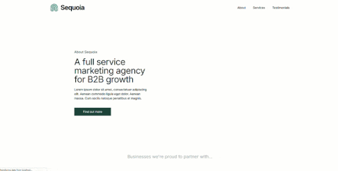
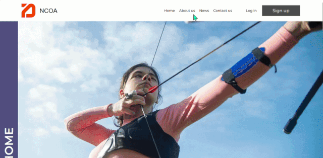

# Portfolio

Hi, I'm Clare - Front-end developer.

I specialise in developing scalable, accessible, and maintainable web applications using React with TypeScript, the Next.js framework, Zod for schema validation, and Prisma ORM with PostgreSQL, supported by a robust SCSS architecture. Below is a curated selection of my work.

 

<h1>Featured projects</h1>

 
<h2>Sequoia landing page</h2>

Sequoia is a Next.js landing page for a fictional B2B marketing agency, built to showcase modern frontend practices with Tailwind CSS v4 and dynamic Motion animations. Its React components follow a modular, reusable architecture, with data served from a PostgreSQL database via Prisma for fully dynamic content. TypeScript provides strong type safety throughout, and the interface is designed with accessibility in mind, including semantic HTML, responsive layouts, clear contrast, and full keyboard support.

 

 

<h3>Project repository link:</h3> 

https://github.com/NorthernWolf22/Sequoia.git

<h3>Tech stack:</h3>

<h3>Skills demonstrated:</h3> 
<ul>
  <li>Next.js with typescript full stack landing page</li>
  <li>Prisma, a type-safe object relational mapper which maps TypeScript models to PostgreSQL tables</li>
  <li>Dynamic animations using Motion (formally framer motion)</li>
  <li>Design‑system thinking translated from Figma to code</li>
  <li>Professional layout composition using a grid system</li>
  <li>Responsive, modular, scalable UI architecture</li>
  <li>Uses modern Tailwind (version 4) utility framework</li>
  <li>Effective defensive UI design / resiliant rendering techniques</li>
</ul>

 
 

<h2>NCOA example Website</h2>

NCOA is a fictional full‑stack sports club website built with Next.js and TypeScript, showcasing modern UI patterns, accessibility, and scalable component architecture. All site data is stored in a PostgreSQL database and accessed through Prisma ORM, enabling dynamic content rendering across multiple pages. The project uses Zod for both client‑ and server‑side validation, ensuring safe, structured data before it reaches the database. A modular React component system, atomic spacing scale, and strong TypeScript typing support maintainability, consistency, and long‑term scalability. Accessibility is integrated throughout, with semantic HTML, responsive layouts, keyboard support, clear validation feedback, and appropriate colour contrast.

 

 

<h3>Project repository link:</h3> 

https://github.com/NorthernWolf22/NCOA-website.git

<h3>Tech stack:</h3>

<h3>Skills demonstrated:</h3> 
<ul>
  <li>Next.js and typescript full stack website</li>
  <li>Dynamic routing using an id parameter</li>
  <li>Server side API route handling</li>
  <li>Client and server components</li>
  <li>Zod validation client and server side</li>
  <li>Prisma, a type-safe object relational mapper which maps TypeScript models to PostgreSQL tables</li>
  <li>Design‑system thinking translated from Figma to code</li>
  <li>Professional layout composition using a grid system</li>
  <li>Responsive, modular, scalable UI architecture</li>
  <li>Clean SCSS structure utilising primitive and semantic variables and BEM methodology</li>
  <li>Effective defensive UI design / resiliant rendering techniques</li>
</ul>

 
 

<h2>Leaf - example e-commerce website</h2>

A fully‑designed and engineered multi‑page website for a fictional houseplant retailer, built to demonstrate modular UI architecture, design‑system thinking, and scalable front‑end engineering. This project is based on a detailed Figma design system and implemented using React, Vite, SCSS (BEM), and React Router v6.

 

 

<h3>Project repository link:</h3> 

https://github.com/NorthernWolf22/Leaf-example-website

<h3>Tech stack:</h3>

<h3>Skills demonstrated:</h3> 
<ul>
  <li>Design‑system thinking translated from Figma to code</li>
  <li>Professional layout composition using a grid system</li>
  <li>Realistic multi‑page routing with dynamic data</li>
  <li>Modular, scalable UI architecture</li>
  <li>Clean SCSS structure utilising primitive and semantic variables and BEM methodology</li>
  <li>API integration using react router loaders and fetch</li>
  <li>Effective error handling</li>
</ul>

 
 

<h2>Example React / Typescript form</h2>

I have developed a responsive React and TypeScript CRUD application using a modular structure with reusable components and state management. Custom type aliases, prop type aliases, function parameter and event type checks ensure application wide type safety.

 

 

<h3>Project repository link:</h3> 

https://github.com/NorthernWolf22/Example-react-ts-form

<h3>Tech stack:</h3>

<h3>Skills demonstrated:</h3> 
<ul>
  <li>Modular, scalable component based UI architecture</li>
  <li>Developed a React and TypeScript CRUD application using strongly typed components and state management</li>
  <li>Created custom TypeScript type aliases and reusable prop types to enforce type safety across the application.</li>
  <li>Implemented typed React event handling (ChangeEvent, SubmitEvent) and callback props.</li>
  <li>Used generic types with React Hooks (useState< Student[]>) to manage strongly typed collections.</li>
  <li>Built reusable form and button components by extending native React HTML attribute types.</li>
  <li>Applied TypeScript features including type inference, intersection types, optional properties, typed arrays, function typing and compile-time prop validation</li>
  <li>Implemented dynamic list rendering, state updates, filtering, form handling and UUID-based record creation.</li>
  <li>Clean SCSS structure utilising primitive and semantic variables and BEM methodology</li>
  <li>Accessibility considerations such as colour contrast and form label to input association</li>
</ul>

 
 

<h2>Wordle game</h2>

This project is a Wordle-inspired word guessing game built with React and Vite. The application retrieves a random five-letter word from a local API and challenges users to guess it within six attempts with colour-coded feedback. State management is handled using React Hooks, with a custom hook encapsulating the game's core logic. The application also demonstrates asynchronous data fetching, component-based architecture, event handling, conditional rendering, and reusable UI design patterns.

 

 

<h3>Project repository link:</h3> 

https://github.com/NorthernWolf22/wordle.git

<h3>Tech stack:</h3>

<h3>Skills demonstrated:</h3> 
<ul>
  <li>
React & Vite application development.
</li>
  <li>
Custom Hooks and state management with React.
</li>
  <li>
Component-based architecture and reusable UI design.
</li>
  <li>
Asynchronous API integration using the Fetch API.
</li>
  <li>
Keyboard event handling and DOM event listener management.
</li>
  <li>
Conditional rendering and dynamic user feedback.
</li>
  <li>
Game logic implementation and input validation.
</li>
</ul>